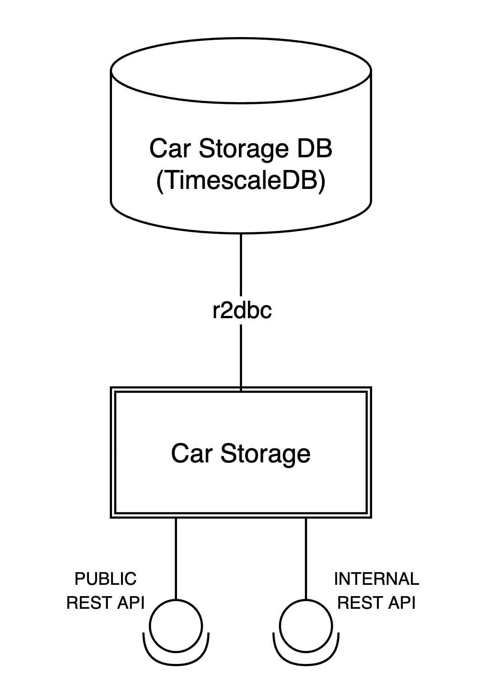

# modern-kotlin-microservice

Car Storage is a system responsible for storing cars data

- Creator: Damian Śniatecki (https://www.linkedin.com/in/damiansn/)
- Stage: early development
- Version: 0.0.1-SNAPSHOT

Architecture:

